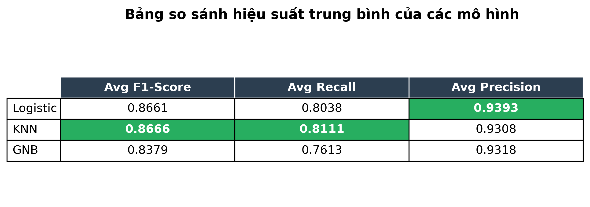

# **Customer Churn Prediction — Bank Churners Dataset**

Dự đoán khả năng rời đi của khách hàng thẻ tín dụng bằng phân tích dữ liệu và các mô hình học máy cài đặt bằng **NumPy**.

---

# **Mục lục**

- [I. Giới thiệu](#i-giới-thiệu)
  - [I.1 Mô tả bài toán](#i1-mô-tả-bài-toán)
  - [I.2 Động lực và ứng dụng thực tế](#i2-động-lực-và-ứng-dụng-thực-tế)
  - [I.3 Mục tiêu cụ thể](#i3-mục-tiêu-cụ-thể)
- [II. Dataset](#ii-dataset)
  - [II.1 Nguồn dữ liệu](#ii1-nguồn-dữ-liệu)
  - [II.2 Kích thước và đặc điểm](#ii2-kích-thước-và-đặc-điểm)
  - [II.3 Mô tả các feature](#ii3-mô-tả-các-features)
- [III. Method](#iii-method)
  - [III.1 Quy trình Khám phá dữ liệu](#iii1-quy-trình-khám-phá-dữ-liệu)
  - [III.2 Quy trình Xử lý dữ liệu](#iii2-quy-trình-xử-lý-dữ-liệu)
  - [III.3 Quy trình Xây dựng model](#iii3-quy-trình-xây-dựng-model)
  - [III.4 Chiến lược Đánh giá & Kiểm thử](#iii4-chiến-lược-đánh-giá--kiểm-thử-mô-hình)
- [IV. Installation & Setup](#iv-installation--setup)
- [V. Usage](#v-usage)
- [VI. Results](#vi-results)
- [VII. Project Structure](#vii-project-structure)
- [VIII. Challenges & Solutions](#viii-challenges--solutions)
- [IX. Future Improvements](#ix-future-improvements)
- [X. Contributors](#x-contributors)
- [XI. License](#-license--mit-license)

---

# I. **Giới thiệu**

## I.1  Mô tả bài toán

Bài toán yêu cầu dự đoán khách hàng thẻ tín dụng **có rời đi** (`attrition`) hay không dựa trên các đặc trưng hành vi và thông tin tài chính. Đây là bài toán **phân loại nhị phân** (`binary classification`)  với mục tiêu tối ưu hóa chiến lược giữ chân khách hàng.

## II.2 Động lực và ứng dụng thực tế

* Khi phải đưa ra chính sách hoặc phương án trong việc giữ lại khách hành tiềm năng hay tìm kiếm khách hàng mới, ta nhận thấy chi phí giữ khách hàng thấp hơn chi phí tìm khách mới nhưng phải biết được những khách hàng nào còn ở lại.

* Có những chính sách giúp giữ lại nhiều khách hàng để giảm thiểu rủi ro rời bỏ dịch vụ, giúp tăng lợi nhuận.

* Dự báo được xu hướng của khách hàng giúp ngân hàng quyết định chiến lược marketing hợp lý.

## II.3 Mục tiêu cụ thể

* Khám phá dữ liệu (EDA) để hiểu hành vi khách hàng. Đồng thời, đưa ra một số khám phá thú vị (insights - nếu có) về dữ liệu

* Tiền xử lý dữ liệu và chuẩn hóa dữ liệu để chuẩn bị cho các mô hình học máy.

* Xây dựng các mô hình học máy bằng **NumPy** (không dùng thư viện ML):

  * Logistic Regression
  * Gaussian Naive Bayes
  * KNN

* Xây dựng một số hàm đánh giá mô hình

---

# II. **Dataset**

## II.1 Nguồn dữ liệu

* Kaggle: [Credit Card Customers Dataset](https://www.kaggle.com/datasets/sakshigoyal7/credit-card-customers)

* Tên file: `BankChurners.csv` (Trong folder data)

* Giấy phép: [CC0: Public Domain](https://creativecommons.org/publicdomain/zero/1.0/)

## II.2 Kích thước và đặc điểm

* Số dòng: **10,127**
* Số cột: **23**
* Nhãn cần dự đoán: **Attrition_Flag** (Existing Customer / Attrited Customer)
* 2 cột cuối (`Naive_Bayes_1`, `Naive_Bayes_2`) bị loại bỏ theo khuyến nghị của tác giả dataset.

## II.3 Mô tả các features:

Bộ dữ liệu bao gồm **23 cột** như sau:

| Tên Cột | Mô Tả | 
| :--- | :--- | 
| `CLIENTNUM` | Mã định danh khách hàng (Unique ID) | 
| `Attrition_Flag` | Trạng thái hoạt động | 
| `Customer_Age` | Độ tuổi khách hàng |
| `Gender` | Giới tính | 
| `Dependent_count` | Số người phụ thuộc | 
| `Education_Level` | Trình độ học vấn | 
| `Marital_Status` | Tình trạng hôn nhân |
| `Income_Category` | Nhóm thu nhập hàng năm | 
| `Card_Category` | Loại thẻ tín dụng |
| `Months_on_book` | Thời gian gắn bó với ngân hàng |
| `Total_Relationship_Count` | Tổng số sản phẩm/dịch vụ sở hữu |
| `Months_Inactive_12_mon` | Số tháng không hoạt động (12 tháng qua) |
| `Contacts_Count_12_mon` | Số lần liên hệ ngân hàng (12 tháng qua) |
| `Credit_Limit` | Hạn mức tín dụng tối đa | 
| `Total_Revolving_Bal` | Tổng dư nợ quay vòng | 
| `Avg_Open_To_Buy` | Hạn mức khả dụng trung bình (mua sắm) | 
| `Total_Amt_Chng_Q4_Q1` | Tỷ lệ thay đổi số tiền giao dịch (Q4 vs Q1) |
| `Total_Trans_Amt` | Tổng tiền giao dịch (12 tháng qua) | 
| `Total_Trans_Ct` | Tổng số lần giao dịch (12 tháng qua) | 
| `Total_Ct_Chng_Q4_Q1` | Tỷ lệ thay đổi số lần giao dịch (Q4 vs Q1) | 
| `Avg_Utilization_Ratio` | Tỷ lệ sử dụng thẻ trung bình | 
| `Naive_Bayes_Classifier..._1` | Kết quả từ thuật toán Naive Bayes (Gốc) - Cột sinh ra từ quá trình xây dựng dữ liệu |
| `Naive_Bayes_Classifier..._2` | Kết quả từ thuật toán Naive Bayes (Gốc) - Cột sinh ra từ quá trình xây dựng dữ liệu |

---

# III. **Method**

## III.1 Quy trình Khám phá dữ liệu
* **File trình bày**: 01_data_exploration.ipynb trong folder notebooks
* **Lưu ý**: Trong quá trình thực hiện việc khám phá dữ liệu ta sẽ xây dựng một từ điển để chúng ta mapping dữ liệu từng cột thống qua tên cột
* **Quá trình thực hiện**: 
  - **Bước 1**: Xác định một số thông tin cơ bản của `Dataset`
    - Xác định số dòng và số cột của dữ liệu. 
    - Xác định tên của từng cột dữ liệu, có bao nhiêu cột định danh và bao nhiêu cột số
    - Xác định khoảng giá trị của từng cột: đối với cột định danh thì in ra các `các giá trị riêng biệt`, còn đối với các cột có giá trị gồm nhiều số thì in ra `số lớn nhất, số nhỏ nhất, số trung bình, trung vị và phương sai`.
    - Xác định kiểu dữ liệu của từng cột và kiểm tra số lượng dữ liệu bị thiếu

  - **Bước 2**: Biểu diễn phân phối của từng cột dữ liệu. Đối với các cột số thì dùng `biểu đồ tần số (Histogram)` kết hợp với `đường cong mật độ (KDE)` , còn đối với các cột định danh thì dùng `biểu đồ cột (Bar chart)` để nhận xét phân phối của từng cột (Ví dụ như: các cột số thì có thể có ` Phân phối chuẩn`, ` Phân phối lệch phải/trái`,v.v còn các cột định danh có thể nhận biết được độ lệch giữa các thành phần)

  - **Bước 3**: Sử dụng `biểu đồ tròn (Pie chart)` để hiển thị phần trăm các giá trị trong các cột định  danh

  - **Bước 4**: Sử dụng `biểu đồ hộp` để so sánh phân phối số liệu trong các cột giá trị số với cột đặc trưng `Attrition_Flag` (được chuẩn hóa thành 0 - `Attrited Customer` và 1 - `Existing Customer`)

  - **Bước 5:** Sử dụng `Countplot (Biểu đồ đếm tần suất được tình bày dưới dạng biểu đồ thanh)` để so sánh phân phối của các cột có giá trị định danh so với cột đặc trưng `Attrition_Flag`

  - **Bước 6:** Vẽ `ma trận tương quan (correlation matrix)` giữa các cột để ta có một số insights cần thiết cho quá trình xử lí dữ liệu và cây dựng model 
    - Đối với các cột số:
      1. Chuẩn hóa cột `Attrition_Flag` (`Existing Customer` &rarr; 1; `Attrited Customer` &rarr; 0)
      2. Sử dụng hệ số tương quan `Pearson` để tính toán và biểu diễn ma trận tương quan (`correlation matrix`) giữa các cột có giá trị số cũng như cột giá trị đặc trưng `Attrition_Flag`

    - Đối với các cột định danh: Sử dụng hệ số `Cramér's V` để tính toán và biểu diễn ma trận tương quan (`correlation matrix`) giữa các cột định danh

## III.2 Quy trình xử lý dữ liệu:
* **File trình bày**: 02_preprocessing.ipynb trong folder notebooks
* **Lưu ý**: Trước khi bắt đầu Xử lí dữ liệu, ta cũng sẽ xây dựng một từ điển để chúng ta mapping dữ liệu từng cột thông qua tên cột giống như trên
* **Quá trình thực hiện**:
  - **Bước 1**: Bỏ những cột không quan trọng trong việc thiết kế mô hình bao gồm   **`Avg_Open_To_Buy`** và  **`Gender`** (Rút ra được từ quá trình `Khám phá dữ liệu`)

  - **Bước 2**: Chuẩn hóa cột đặc trưng Attrition_Flag và các cột định danh. 

  - **Bước 3**: Sử dụng Z-Score Scaling cho các nhóm phân phối chuẩn

  - **Bước 4**:Tạo cột mới: `Avg_Total_Trans`bằng cách lấy thương của phép chia `Total_Trans_Amt` và `Total_Trans_Ct`

  - **Bước 5:** Sữ dụng Log Scaling cho những cột có phân phối lệch phải, có giá trị lớn 

  - **Bước 6:**  Sử dụng MinMax cho những cột đã nằm trong phạm vi [0, 1]

  - **Bước 7:** Lưu lại dưới liệu dưới dạng file mới `BankChurners_preprocessed.csv` trong file data


---

## III.3 Quy trình xây dựng model:
### III.3.1 Thuật toán Logistic Regression

**Định nghĩa:**
Đây là thuật toán học máy có giám sát (Supervised Learning) có thể được sử dụng cho bài toán phân loại nhị phân (Binary Classification), đưa ra dự đoán dưới dạng xác suất (0 hoặc 1).

**Quy trình xây dựng và tối ưu mô hình:**

Quá trình huấn luyện được thực hiện qua các bước lặp (epochs) với cơ chế Gradient Descent:

**1. Khởi tạo tham số (Initialization)**
Thiết lập trạng thái ban đầu cho mô hình chưa được huấn luyện:
* Trọng số $w$ là vector 0 (Cài đặt bằng `np.zeros` trong Numpy) và hệ số chệch $b = 0$.

**2. Quá trình Lan truyền xuôi (Forward Propagation)**
Tính toán dự đoán xác suất dựa trên dữ liệu đầu vào:
* **Tổ hợp tuyến tính:**
    $$z = w \cdot X + b$$
* **Hàm kích hoạt Sigmoid:**
    $$\hat{y} = \frac{1}{1 + e^{-z}}$$
* **Lưu ý kỹ thuật (NumPy):** Để đảm bảo tính ổn định số học và tránh lỗi tràn số (overflow) khi tính hàm mũ `np.exp`, giá trị của $z$ được giới hạn trong khoảng [-250, 250] bằng hàm `np.clip`.

**3. Tính toán Gradient (Backward Propagation)**
Tính đạo hàm của hàm mất mát để xác định hướng điều chỉnh tham số. Việc tính toán được **vector hóa** hoàn toàn bằng `np.dot` giúp tăng tốc độ xử lý so với vòng lặp thông thường:
* **Gradient của trọng số $w$:**
    $$dw = \frac{1}{m} X^T (\hat{y} - y)$$
* **Gradient của hệ số $b$:**
    $$db = \frac{1}{m} \sum_{i=1}^{m} (\hat{y}^{(i)} - y^{(i)})$$

**4. Cập nhật tham số (Parameter Update)**
Điều chỉnh tham số ngược hướng Gradient để giảm thiểu sai số, với $\alpha$ là tốc độ học (learning rate):
* $w_{new} = w_{old} - \alpha \times dw$
* $b_{new} = b_{old} - \alpha \times db$

**5. Dự đoán (Prediction)**
Sau khi tối ưu hóa $w$ và $b$, mô hình đưa ra kết quả phân loại dựa trên ngưỡng xác suất (Threshold):
* Nếu $\hat{y} > 0.5 \Rightarrow$ Lớp 1.
* Ngược lại $\Rightarrow$ Lớp 0.

---

### III.3.2 Thuật toán K-Nearest Neighbors (KNN)

**Định nghĩa:**
Đây là thuật toán thuộc nhóm **Học lười (Lazy Learning)** và **Phi tham số (Non-parametric)** dùng cho bài toán phân loại. Khác với các mô hình học máy thông thường, KNN không huấn luyện để tìm ra bộ trọng số cố định mà trực tiếp ghi nhớ toàn bộ dữ liệu. Quyết định phân loại dựa trên sự tương đồng giữa dữ liệu mới và dữ liệu đã biết.

**Quy trình xây dựng mô hình:**

**1. Ghi nhớ dữ liệu (Training Phase)**
Mô hình chỉ thực hiện việc lưu trữ dữ liệu huấn luyện (`X_train`, `y_train`) vào bộ nhớ mà không thực hiện bất kỳ phép tính toán nào tại bước này.

**2. Dự đoán (Prediction Phase)**
Khi tiếp nhận dữ liệu đầu vào mới, thuật toán thực hiện chuỗi xử lý sau:

* **Tính toán khoảng cách (Vectorized Distance Calculation):**
    Mục tiêu là tính khoảng cách Euclidean giữa điểm dữ liệu mới và toàn bộ tập dữ liệu huấn luyện. Để tối ưu hóa tốc độ xử lý trên ma trận lớn, thay vì dùng vòng lặp, đoạn code sử dụng hằng đẳng thức vector hóa:
    $$(A - B)^2 = A^2 + B^2 - 2AB$$
    
    Công thức triển khai:
    $$Distance = \sqrt{X_{new}^2 + X_{train}^2 - 2(X_{new} \cdot X_{train}^T)}$$
    
    Trong đó, tích vô hướng ($2AB$) đóng vai trò cốt lõi giúp tận dụng sức mạnh tính toán ma trận của NumPy.

* **Tìm kiếm láng giềng (Nearest Neighbor Search):**
    Sử dụng `np.argsort` để sắp xếp khoảng cách từ nhỏ đến lớn, sau đó trích xuất $k$ chỉ số (index) có khoảng cách nhỏ nhất tương ứng với $k$ láng giềng gần nhất.

* **Bầu chọn đa số (Majority Voting):**
    Xác định nhãn của dữ liệu mới dựa trên nguyên tắc "thiểu số phục tùng đa số" trong tập $k$ láng giềng. Sử dụng `np.bincount` để đếm tần suất xuất hiện của các nhãn và `argmax` để chọn ra nhãn có số phiếu cao nhất.

---

### III.3.3 Thuật toán Gaussian Naive Bayes

* **Định nghĩa**
Đây là thuật toán phân loại dựa trên **Định lý Bayes** với giả định rằng các đặc trưng (features) độc lập với nhau và tuân theo phân phối chuẩn (Gaussian distribution).

* **Quy trình xây dựng mô hình**

**1. Huấn luyện (Training Phase - Thống kê dữ liệu)**
Thay vì tối ưu hóa hàm mất mát, mô hình "học" bằng cách tính toán trực tiếp các tham số thống kê cho từng lớp dữ liệu:
* **Tham số phân phối:** Tính giá trị trung bình ($\mu$) và phương sai ($\sigma^2$) cho từng đặc trưng của mỗi lớp.
* **Xác suất tiên nghiệm ($P(Class)$):** Tính tỷ lệ xuất hiện của mỗi lớp trong tập huấn luyện.
* **Ổn định số học:** Cộng thêm một hằng số cực nhỏ (`1e-9`) vào phương sai để làm mượt (smoothing), ngăn chặn lỗi chia cho 0.

**2. Dự đoán (Prediction Phase - Log-Likelihood)**
Để tránh lỗi tràn số dưới (numerical underflow) khi nhân nhiều giá trị xác suất nhỏ, thuật toán thực hiện tính toán trong không gian Logarit kết hợp với kỹ thuật **Broadcasting** của NumPy để xử lý song song trên ma trận 3 chiều (Samples x Classes x Features):

* **Tính Log-Likelihood:**
  Độ "khớp" của dữ liệu mới với phân phối chuẩn của từng lớp được tính theo công thức:
  $$\log P(x|c) = -\frac{1}{2} \sum \left( \log(2\pi\sigma_c^2) + \frac{(x - \mu_c)^2}{\sigma_c^2} \right)$$
  *(Bao gồm tổng của phần log mẫu số chuẩn hóa và khoảng cách Mahalanobis bình phương).*

* **Quyết định phân loại (Maximum A Posteriori):**
  Áp dụng định lý Bayes bằng cách cộng Log-likelihood với Log xác suất tiên nghiệm và chọn lớp có giá trị lớn nhất:
  $$\hat{y} = \text{argmax} \left( \log P(x|c) + \log P(c) \right)$$


## III.4 Chiến lược đánh giá & kiểm thử Mô hình

Để đảm bảo kết quả đánh giá khách quan và tối ưu hóa hiệu năng mô hình, quy trình kiểm thử được xây dựng chặt chẽ thông qua 3 thành phần chính:

* **Kỹ thuật K-Fold Cross-Validation**
Thay vì chỉ chia dữ liệu một lần (Train/Test split truyền thống), ta áp dụng **K-Fold** để giảm thiểu phương sai và đánh giá độ ổn định của mô hình:
  1.  **Xáo trộn (Shuffle):** Đảm bảo tính ngẫu nhiên, phá vỡ thứ tự sắp xếp gốc của dữ liệu.
  2.  **Chia & Xoay vòng:** Dữ liệu được chia thành $k$ phần. Quy trình lặp $k$ lần, mỗi lần chọn một phần làm tập Test (Validation) và phần còn lại làm tập Train.

* **Quy trình vận hành (`evaluate_models`)**
Hàm quản lý luồng đánh giá tuân thủ nghiêm ngặt nguyên tắc **chống rò rỉ dữ liệu (Data Leakage Prevention)**:
  * **Bước 1 - Tách dữ liệu:** Tại mỗi vòng lặp K-Fold, dữ liệu được chia thành `Train_fold` và `Test_fold`.
  * **Bước 2 - Xử lý mất cân bằng:** Hàm `oversample_minority` **CHỈ được áp dụng trên `Train_fold`**. Tập `Test_fold` được giữ nguyên bản để phản ánh đúng thực tế.
  * **Bước 3 - Tổng hợp:** Kết quả của $k$ lần chạy được tính trung bình (`np.mean`) để đưa ra con số hiệu năng cuối cùng đáng tin cậy nhất.

* **Các chỉ số đánh giá (Metrics)**
Dựa trên **Ma trận nhầm lẫn (Confusion Matrix)** với các yếu tố TP (Dương tính thật), FP (Dương tính giả) và FN (Âm tính giả), hiệu năng mô hình được đo lường qua:

  * **Precision (Độ chính xác dự báo dương):** Tỉ lệ dự đoán đúng trong các trường hợp mô hình báo là Positive.
    $$P = \frac{TP}{TP + FP}$$
  * **Recall (Độ nhạy):** Khả năng mô hình phát hiện được bao nhiêu % trường hợp Positive thực tế.
    $$R = \frac{TP}{TP + FN}$$
  * **F1-Score:** Trung bình điều hòa giữa Precision và Recall, là chỉ số quan trọng nhất để đánh giá sự cân bằng của mô hình trên dữ liệu lệch.
    $$F1 = 2 \times \frac{P \times R}{P + R}$$

# IV. **Installation & Setup**

Cần đảm bảo máy tính đã cài đặt **Python 3.8+** và các thư viện cần thiết.

**1. Clone dự án:**

```bash
git clone https://github.com/AnhTtis/Customer-Analysis
cd Customer-Analysis
```
**2. Cài đặt thư viện:**

```bash
pip install -r requirements.txt
```

# V. **Usage**

Dự án được chia thành 3 giai đoạn chính, tương ứng với 3 file notebooks trong thư mục `notebooks`. Ta cần chạy lần lượt theo thứ tự sau để đảm bảo luồng dữ liệu chính xác:

**Bước 1: Khám phá dữ liệu (EDA)**

  * **File:** `notebooks/01_data_exploration.ipynb`
  * **Chức năng:** Chạy file này đầu tiên để sinh ra các biểu đồ phân tích, kiểm tra phân phối và hiểu rõ cấu trúc dữ liệu.

**Bước 2: Tiền xử lý dữ liệu (Preprocessing)**

  * **File:** `notebooks/02_preprocessing.ipynb`
  * **Chức năng:** Thực hiện làm sạch dữ liệu, mã hóa (Encoding) và chuẩn hóa (Scaling).
  * **Output:** File này sẽ xuất ra file `data/BankChurners_preprocessed.csv` dùng để train model.

**Bước 3: Huấn luyện & Đánh giá mô hình**

  * **File:** `notebooks/03_modelling.ipynb`
  * **Chức năng:** Load dữ liệu đã xử lý, cài đặt thuật toán (Logistic, KNN, GNB), thực hiện Cross-Validation và xuất kết quả đánh giá.

# VI.**Results**

## VI.1 Kết quả định lượng (Quantitative Metrics)

Sau khi thực hiện quy trình **10-Fold Cross-Validation**, hiệu năng trung bình của các mô hình được ghi nhận như sau:

| Mô hình (Model) | Avg F1-Score | Avg Recall | Avg Precision |
| :--- | :--- | :--- | :--- |
| **Logistic Regression** | 0.8651 | 0.8024 | **0.9386** |
| **K-Nearest Neighbors** | **0.8666** | **0.8120** | 0.9294 |
| **Gaussian Naive Bayes** | 0.8384 | 0.7616 | 0.9328 |

## VI.2 Trực quan hóa kết quả

*Biểu đồ so sánh hiệu năng giữa 3 mô hình dựa trên chỉ số F1-Score qua 10 lần chạy (folds)*




## VI.3 So sánh và phân tích

Dựa trên bảng số liệu tổng hợp, ta có những nhận định sau:

**1. Về tổng thể:**

  * **K-Nearest Neighbors (KNN)** là mô hình có hiệu suất tốt nhất với **F1-Score cao nhất (0.8666)** và độ ổn định cao qua các fold.
  * **Logistic Regression** bám đuổi rất sát sao (F1 \~ 0.8651), cho thấy ranh giới tuyến tính cũng phân loại khá hiệu quả bộ dữ liệu này.
  * **Gaussian Naive Bayes (GNB)** có hiệu năng thấp nhất trong 3 mô hình (F1 \~ 0.8384).

**2. Về khả năng phát hiện khách hàng rời bỏ (Recall):**

  * Đây là chỉ số quan trọng nhất trong bài toán Churn Prediction (tránh bỏ sót khách hàng sắp rời đi).
  * **KNN** tiếp tục dẫn đầu với **Recall đạt 81.2%**, nghĩa là mô hình tìm ra được nhiều khách hàng rời bỏ nhất.
  * **GNB** có Recall thấp nhất (chỉ 76.16%), cho thấy mô hình này bỏ sót một lượng đáng kể khách hàng tiềm năng cần quan tâm.

**3. Về độ tin cậy của dự báo (Precision):**

  * **Logistic Regression** đạt **Precision cao nhất (93.86%)**. Điều này có nghĩa là khi mô hình này dự báo một khách hàng sẽ rời bỏ, tỉ lệ chính xác là rất cao, ít khi báo động giả.
  * Tuy nhiên, cả 3 mô hình đều có Precision rất cao (\>92%), cho thấy thách thức chính nằm ở việc cải thiện Recall chứ không phải Precision.

**4. Kết luận:**

  * **KNN** là ứng cử viên sáng giá nhất để triển khai thực tế nhờ sự cân bằng tốt giữa việc tìm ra khách hàng (Recall) và độ chính xác (Precision).
  * Tuy nhiên, nếu cần một mô hình đơn giản, dễ giải thích (Explainable AI) và tốn ít tài nguyên tính toán hơn khi dự báo, **Logistic Regression** là một phương án thay thế rất tốt với hiệu năng gần như tương đương.


# VII.**Project Structure**

Cấu trúc thư mục của dự án được tổ chức như sau:

```text
CUSTOMER-ANALYSIS/
│
├── data/                               # Chứa dữ liệu
│   ├── BankChurners.csv                # Dữ liệu gốc (Raw Data)
│   └── BankChurners_preprocessed.csv   # Dữ liệu đã qua xử lý (sẵn sàng train)
│
├── images/                             # Chứa hình ảnh biểu đồ xuất ra từ Notebook
│
├── notebooks/                          # Mã nguồn chính (Source Code)
│   ├── 01_data_exploration.ipynb       # Phân tích khám phá dữ liệu (EDA)
│   ├── 02_preprocessing.ipynb          # Xử lý, làm sạch và chuẩn hóa dữ liệu
│   └── 03_modelling.ipynb              # Xây dựng, huấn luyện và kiểm thử mô hình
│
├── README.md                           # Tài liệu hướng dẫn dự án
└── requirements.txt                    # Danh sách các thư viện cần cài đặt
```

# VIII. **Challenges & Solutions**

Trong quá trình thực hiện dự án, đặc biệt là việc ứng dụng **NumPy** để xây dựng thuật toán từ đầu (from scratch), em đã gặp một số thách thức:

**1. Khó khăn về Vector hóa (Vectorization)**

  * **Vấn đề:** Việc chuyển đổi các công thức toán học phức tạp (như tính khoảng cách Euclidean trong KNN hay Log-likelihood trong Naive Bayes) từ dạng vòng lặp `for` sang dạng tính toán ma trận để tận dụng sức mạnh của NumPy rất trừu tượng và dễ sai sót về chiều (dimensions).
  * **Giải pháp:** Sử dụng cơ chế **Broadcasting** của NumPy và kiểm tra kỹ kích thước ma trận (`.shape`) sau từng bước tính toán. Sử dụng các hàm `np.expand_dims` hoặc `np.newaxis` để căn chỉnh chiều dữ liệu phù hợp.

**2. Vấn đề ổn định số học (Numerical Stability)**

  * **Vấn đề:** Trong thuật toán Gaussian Naive Bayes, việc nhân liên tiếp các giá trị xác suất nhỏ dẫn đến lỗi tràn số dưới (underflow), khiến kết quả về 0. Ngoài ra, phương sai bằng 0 gây lỗi chia cho 0.
  * **Giải pháp:** Chuyển sang tính toán trong không gian **Logarit** (tổng thay vì tích) và cộng thêm một hằng số nhỏ (`epsilon = 1e-9`) vào phương sai để làm mượt (smoothing).

**3. Xử lý mất cân bằng dữ liệu**

  * **Vấn đề:** Dữ liệu lớp `Attrited Customer` quá ít khiến mô hình có xu hướng dự đoán toàn bộ là khách hàng hiện hữu để đạt Accuracy cao ảo.
  * **Giải pháp:** Tự xây dựng hàm `oversample_minority` sử dụng NumPy để nhân bản ngẫu nhiên lớp thiểu số, kết hợp xáo trộn (`permutation`) để cân bằng lại tập huấn luyện.

# IX. **Future Improvements**

Để dự án hoàn thiện và có tính ứng dụng cao hơn, các hướng phát triển tiếp theo bao gồm:

1.  **Tối ưu tham số (Hyperparameter Tuning):** Tự xây dựng hàm GridSearch để tìm ra tham số $k$ tối ưu cho KNN hoặc `learning_rate` tốt nhất cho Logistic Regression.
2.  **Mở rộng thuật toán:** Thử nghiệm các mô hình phi tuyến tính mạnh mẽ hơn như Decision Tree, Random Forest hoặc XGBoost.
3.  **Triển khai (Deployment):** Xây dựng giao diện web đơn giản bằng Streamlit để người dùng có thể nhập thông tin và nhận dự đoán trực tiếp.
4.  **Feature Engineering:** Nghiên cứu tạo ra các biến đặc trưng mới (ví dụ: tỉ lệ giao dịch trên thu nhập) để tăng độ chính xác.

# X. **Contributors**

Dự án được thực hiện bởi:

  * **Họ và tên:** Nguyễn Hữu Anh Trí
  * **MSSV:** 23127130
  * **Email:** nguyenhuuanhtri866@gmail.com
  * **Trường:** Đại học Khoa học Tự nhiên, ĐHQG-HCM (HCMUS)

# XI. **License — MIT License**

```
MIT License

Copyright (c) 2025 AnhTtis

Permission is hereby granted, free of charge, to any person obtaining a copy...
```
